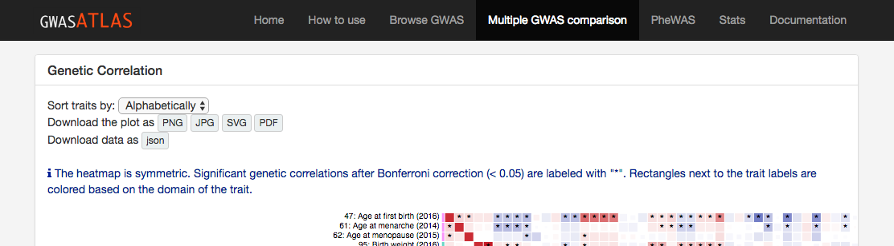

# Generic Correlation and MAGMA genes overlap heatmap from GWAS atlas website

On a website for atlas of GWAS summary stiatistics ([http://atlas.ctglab.nl](http://atlas.ctglab.nl)),
we provide multiple GWAS comparison.
The website provides heatmaps for pair-wise genetic correlation and overlap of significant genes based on MAGMA gene analyses.
When more than 100 traits are compared, those heatmaps are not displayed on the website since it needs to display large number of objects which slows down performance of the website.
We instead provide the option to download json data and you can reproduce the heatmap on your local computer using d3js script from this repository.


## How to visualize the heatmap on your computer
First clone this repository.
```
git clone https://github.dom/Kyoko-wtnb/GWASatlas-plots.git
```
To visualize genetic correlation heatmap,
```
cd /path/to/GWASatlas-plots/LDSC_GC_heatmap
php -S localhost:8888
```
then go to `localhost:8888` from your browser.
This should display the genetic correlation heatmap.

Similar to this, to visualize heatmap for overlapping MAGMA genes,
```
cd /path/to/GWASatlas-plots/MAGMA_genes_heatmap
php -S localhost:8888
```
then go to `localhost:8888` from your browser.


## Get input data
Input json file can be downloaded from GWAS atlas website.

First select GWAS that you want to compare from [http://atlas.ctglab.nl/multiGWAS](http://atlas.ctglab.nl/multiGWAS) and click `Compare selected GWAS` button.

At the top of the panel for heatmap, you can find a button to download json file.



Input data needs to be located under the correct directory with the correct name.
```
# input file for genetic correlation
GWASatlas-plots/LDSC_GC_heatma/GC.json
# input file for overlapping MAGMA genes
GWASatlas-plots/MAGMA_genes_heatmap/MAGMA_genes.json
```
You can modify the file location and name in javascript as described in the next section.

## Customize the heatmap
Comming soon...

## Input data structure
Comming soon...

## Citation

## License
This repository is lincenced under GNU General Public License v3.0.
